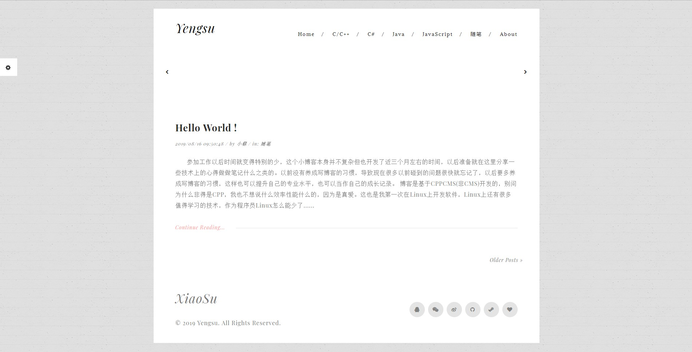
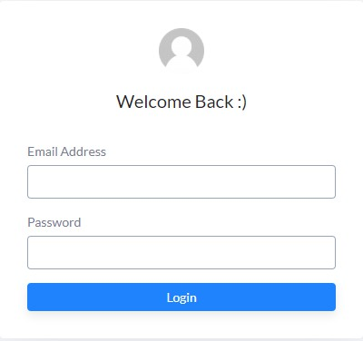
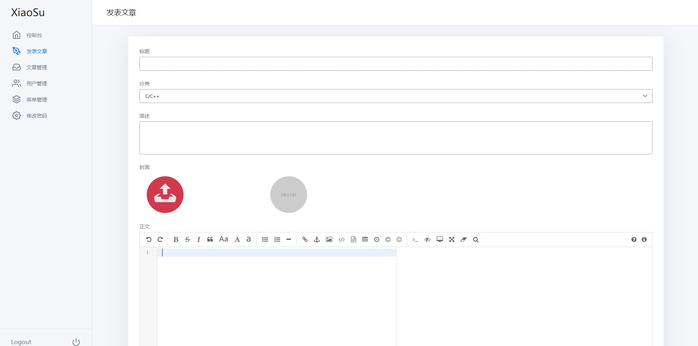
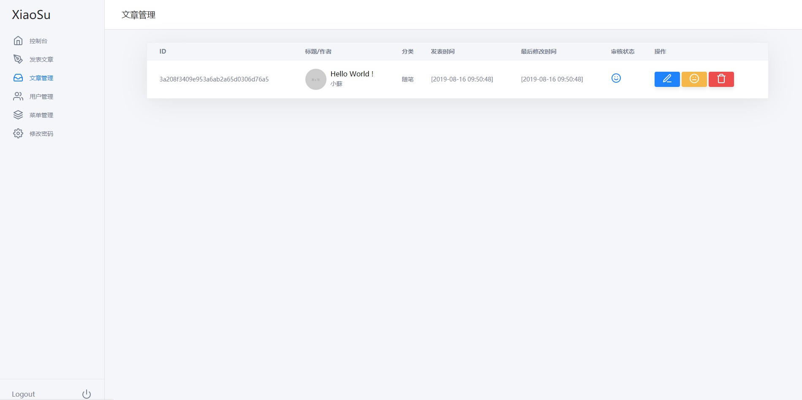
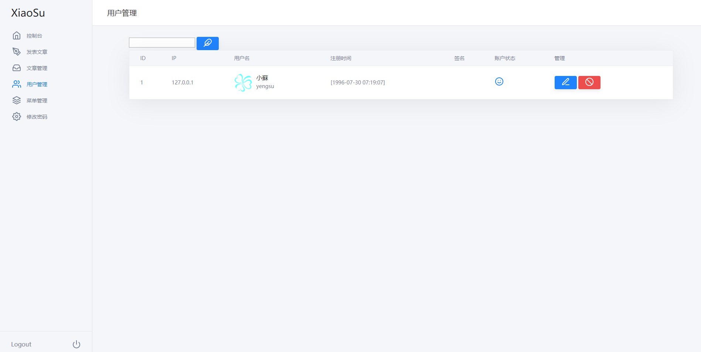
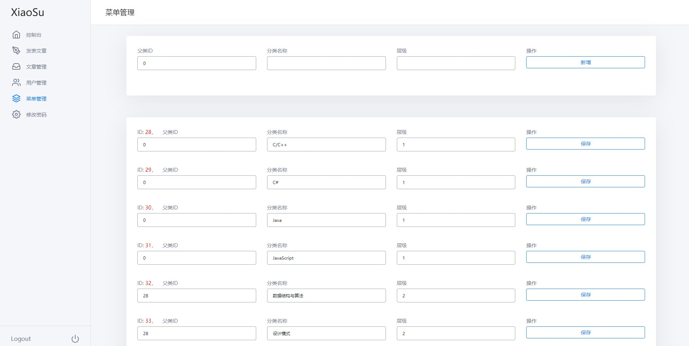

# XiaoSuBlog

## 关于项目
该博客是基于CPPCMS实现的一个个人博客系统。 主要使用的框架和库包括 cppcms、StringTemplate、libcurl、cppdb、html、js等。 

## 效果预览
预览地址：https://www.yengsu.com
### 前台效果图

### 后台效果图
##### 登录界面

##### 发布博客

##### 博客管理

##### 用户管理

##### 菜单管理

后台地址：/xiaosu/admin

